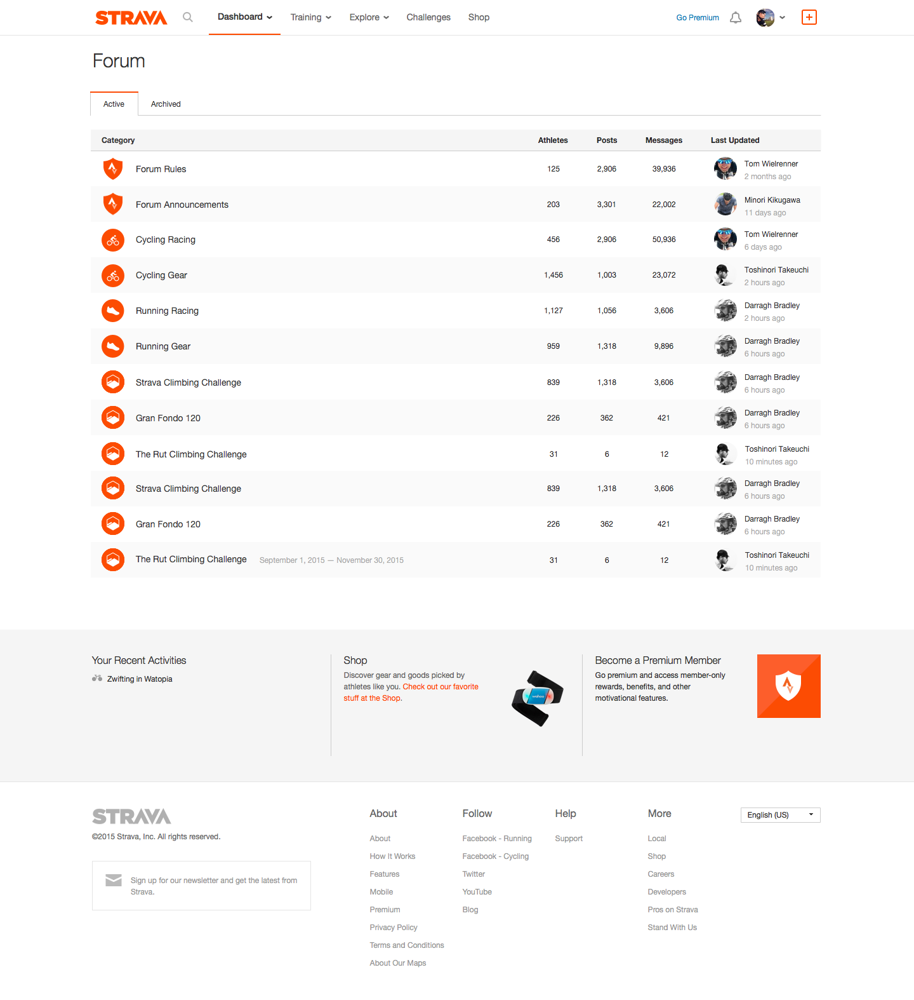
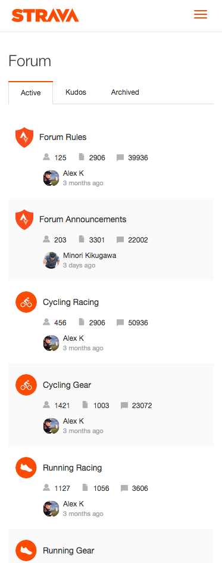
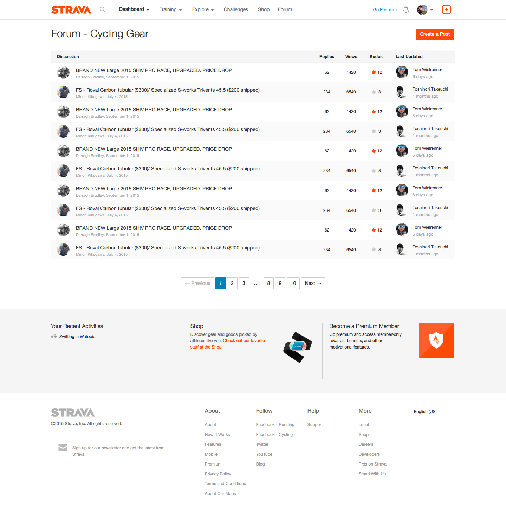
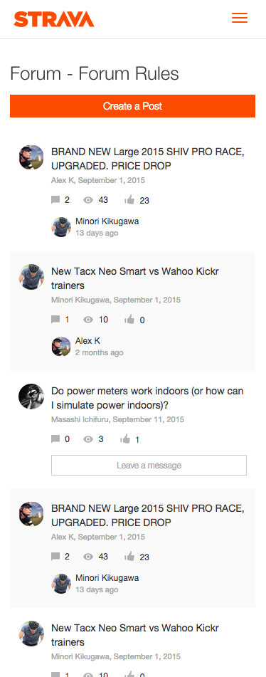
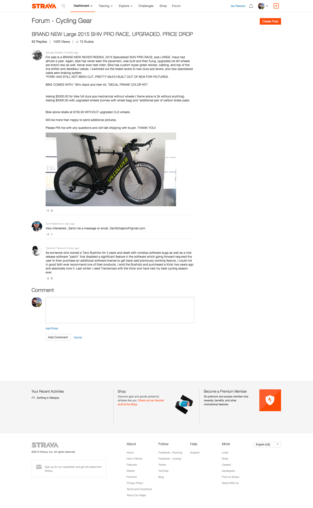
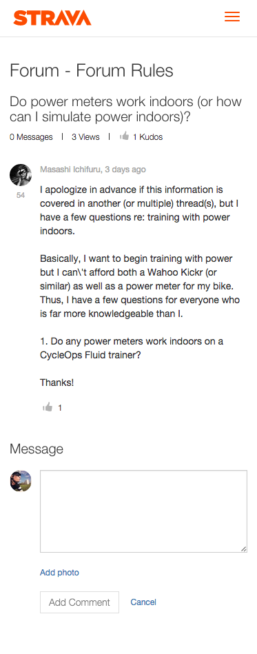
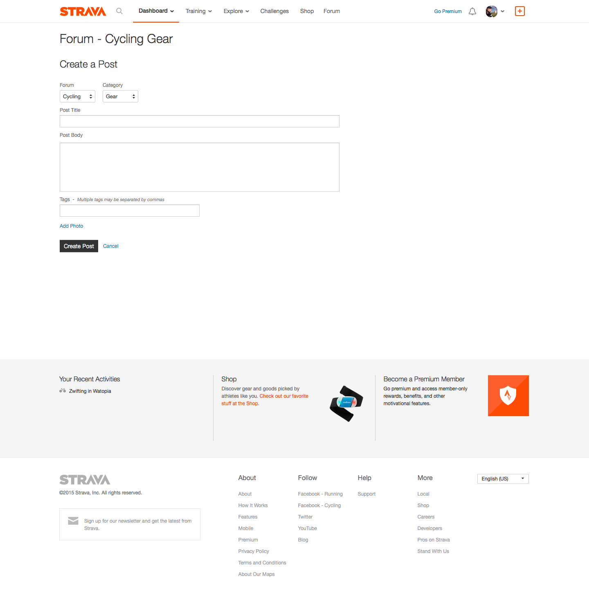
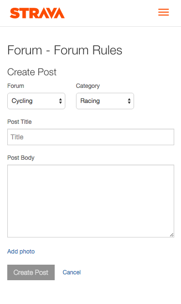

# Forum Prototype Design
Main focus for design was to maintain the look/design with the exciting Strava website, when a user is logged in, and not to do redesign or add too much new look/design so it naturally fits into the existing website.

## [Forum Top](001_Forum_Top.png)

&nbsp;&nbsp;&nbsp;&nbsp;&nbsp;&nbsp;&nbsp;&nbsp;&nbsp;&nbsp;&nbsp;

##### Design Inspiration
- https://www.strava.com/athlete/segments/starred

By having icons for categories makes it visually easy to quickly find the topic you want to read/post about.
Added Active,Kudos and Archived tabs so the forum top page could be kept simple, less items easier to find hot topics. In Kudos tab there will be all post displayed that the user has kudo in the forum, easier for users to find topics they like, like "Tour de France" etc.  Also, after a challenges is finished, after couple of month or so I believe not many users would be active on those challenges posts so making them archived seems to be a nice option.

Might be nice:
- In "Last Updated" column, when a user name is hovered show a popover with some user data
  - How active
  - Runner? Cyclist?
  - ...
- Add some description or general notification information to top section of the page

## [Post List](002_Post_List.png)

&nbsp;&nbsp;&nbsp;&nbsp;&nbsp;&nbsp;&nbsp;&nbsp;&nbsp;&nbsp;&nbsp;

##### Design Inspiration
- https://www.strava.com/athlete/segments/starred

By having a similar look and structure as the forum top page users should easily understand the UI. Made the "Create a Post" button color Strava orange so it's more easy to find/mnotice where  the functionality is.
By having the users icon/image an the most left would provide a better visual information on who's post it is, if you see your friend or a user your following you would be more likely to read the post.

Might be nice:
- Add some icon that indicates there are new unread post
- On post title hover, show a popover with post summary
- On "Last Update" user block, show a popover with latest message
- Some kind of filtering for posts

## [Post Detail](003_Post_Detail.png)

&nbsp;&nbsp;&nbsp;&nbsp;&nbsp;&nbsp;&nbsp;&nbsp;&nbsp;&nbsp;&nbsp;

##### Design Inspiration
- https://www.strava.com/clubs/104412/discussion
- https://www.strava.com/discussions/club/38013/posts/349406/comments

Kept the same feel and design from above links. Each user has an number under their user icon, which is an kudos count, similar indicator as on Stack Overflow, you can judge if that user has good reputation and if his answers could be trusted.

Might be nice for the right panel:
- Show a list of users whom wrote comments
- Show tag list
- Show all added images in a list

## [Create Post](004_Create_Post.png)

&nbsp;&nbsp;&nbsp;&nbsp;&nbsp;&nbsp;&nbsp;&nbsp;&nbsp;&nbsp;&nbsp;

##### Design Inspiration
- https://www.strava.com/clubs/new

Kept the same feel and design from above link. Not really sure if to keep tags.

Might be nice:
- Drag and drop for photo adding/upload
- Have an rich editor for posting comments
- Some rules or tips for writing posts
- Add users for discussion (@user_name)
